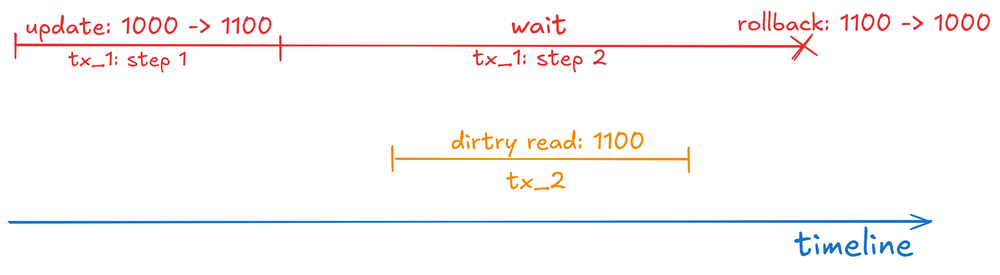

## Scenario

We have two concurrent transactions: tx_1 and tx_2. While tx_1 is updating an amount for the account with id = 1, tx_2 reads it with the isolation level READ UNCOMMITTED. No matter what isolation level tx_1 has, tx_2 still successfully gets the uncommitted results of tx_1.

