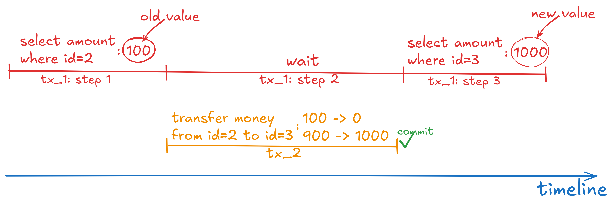

## Scenario

We have two concurrent transactions: tx_1 and tx_2. Tx_1 sequentially reads both of Bob's accounts, but it has a delay before reading the second account. During this delay, tx_2 transfers money from the first Bob's account to the second one. This leads to an inconsistency in tx_1, because the first account has an old amount (before the transfer) and the second account has a new amount (after the transfer), and the total sum of these amounts is greater than the actual one.

