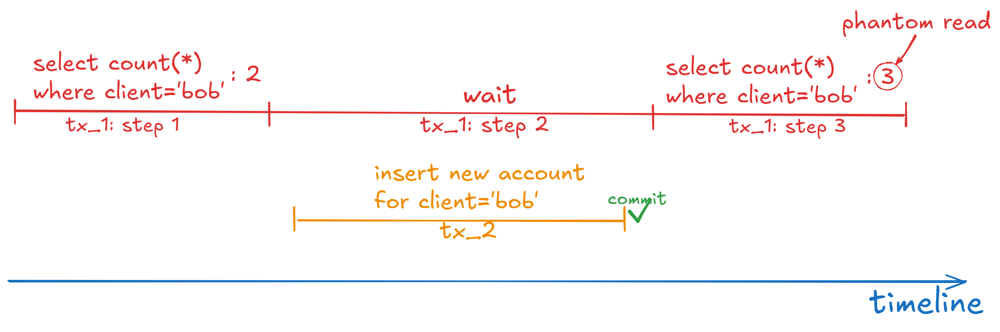

## Scenario

We have two concurrent transactions: tx_1 and tx_2. Tx_1 reads the same subset of records twice, but it has a delay before the second read. During this delay, tx_2 inserts a new record to the subset. This leads to a different result for the second read in tx_1.

