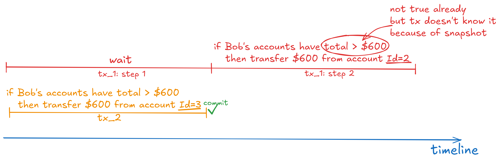

## Scenario

We have two concurrent transactions: tx_1 and tx_2. Both tx_1 and tx_2 transfer money from Bob's accounts, but before transferring they check that Bob has enough money for it. Tx_1 starts its execution first, but it has a delay before the transfer. During this delay, tx_2 starts and successfully transfers money. This leads to an inconsistent update result in tx_1.

